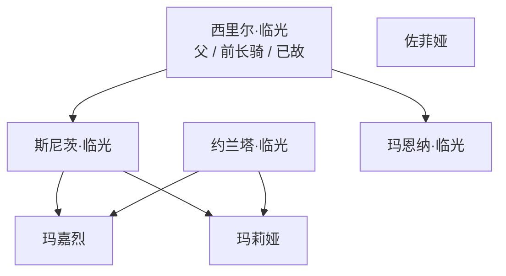

# 剧情与人物（总览）

细纲在 `剧情/` 里，按「以后要调用」的方式拆开。本页只放地图、编年骨架和人物速查。

| 文件 | 用来干什么 |
| --- | --- |
| [剧情/00-阅读说明.md](剧情/00-阅读说明.md) | 可信度、命名、未解清单 |
| [剧情/01-背景与编年.md](剧情/01-背景与编年.md) | 卡西米尔、临光家、完整生平 |
| [剧情/02-活动细纲.md](剧情/02-活动细纲.md) | 各活动按场次还原 |
| [剧情/03-人物与主题.md](剧情/03-人物与主题.md) | 关系档案、对照、主题、可用短句 |

正文是剧情还原，不是游戏原文。对白只留短句。需要原文回情报处理室。

## 出场一览

| 作品 | 时间位置 | 他在做什么 |
| --- | --- | --- |
| 模组「鞘中人」 | 回大骑士领最初几年 | 车库磨剑、读报、面试、带孩子 |
| 《玛莉娅·临光》 | 第 24 届特锦赛选拔 | 反对参赛，多在镜头外；与玛莉娅争执 |
| 《红松林》 | 选拔与正赛之间 | 与玛嘉烈决斗（未用法术，落败），同意她重称耀骑士 |
| 《长夜临光》 | 特锦赛正赛 | 读报挡无胄盟、护宅拔剑、决赛护路；见玄铁后去休假寻人 |
| 《日暮寻路》 | 特锦赛后三个月假 | 主场。茨沃涅克事件，与切斯柏对决，得知兄嫂曾在莱塔尼亚 |
| 加入罗德岛 | 特锦赛后约两个月 | 协助卡西米尔事务，2 月 10 日辞职信 |
| 「远路」 | 加入后某次寻人 | 为临光家剑枪进入莱塔尼亚前夜 |
| 《崔林特尔梅之金》 | 莱塔尼亚线 | 薇薇安娜发现临光徽记骑枪后致信，他最快赶到追问 |

## 编年骨架

1. 少年：随西里尔随征战骑士远游，学战场剑术。  
2. 游侠：不入团、不受勋，与托兰、切斯柏等人行走荒野。外界传说里有「无光骑士」。  
3. 约 25 年前：斯尼茨、约兰塔在对乌萨斯战役中扬名，随后淡出。  
4. 约 15 / 十多年前：兄嫂被征战骑士接走后失踪；他结束游侠，回城坐班、养父、带玛莉娅。  
5. 玛嘉烈夺冠后被流放，他继续用十年全勤把临光家撑住。  
6. 玛莉娅为保贵族名籍参赛 → 玛嘉烈归来 → 叔侄决斗 → 特锦赛正赛拔剑。  
7. 假期南下寻人 → 切斯柏政变 → 线索指向莱塔尼亚 → 接罗德岛邀请。  
8. 仍在找。骑枪出现在崔林特尔梅荒域。

## 人物速查

| 人 | 一句话 |
| --- | --- |
| 西里尔 | 战争英雄、家训「不畏苦暗」。说好斗的年轻骑士才适合长剑。 |
| 斯尼茨 / 约兰塔 | 兄嫂。他只说「他是我的兄弟」。多数人认死，他不认。 |
| 玛嘉烈 | 侄女。他反对她把临光接到特锦赛；决斗落败；决赛夜仍拔剑护她。 |
| 玛莉娅 | 他带大的孩子。他自认不是父亲。她替他站上他拒绝的长骑位置。 |
| 佐菲娅 | 亲戚，陪玛莉娅长大，促成耀骑士复位。后来短谈解开玛莉娅心结。 |
| 托兰 | 旧日赏金猎人同伴。他嘴上拒绝，托兰仍按「关他的事」行动。 |
| 切斯柏 | 旧战友。两次求助他都没让路。日暮寻路里死在对决中，临终说出莱塔尼亚偶遇。 |
| 罗伊 / 玄铁 | 无胄盟。读报长椅与罗伊对峙；玄铁欣赏他的光与怒。 |
| 闪灵 | 长椅第三者。他希望她劝耀骑士离开大骑士领。 |
| 薇薇安娜 | 发现骑枪后想见玛嘉烈，来的是他。 |
| 博士 | 一时同行。他不信罗德岛的图景能实现。 |
